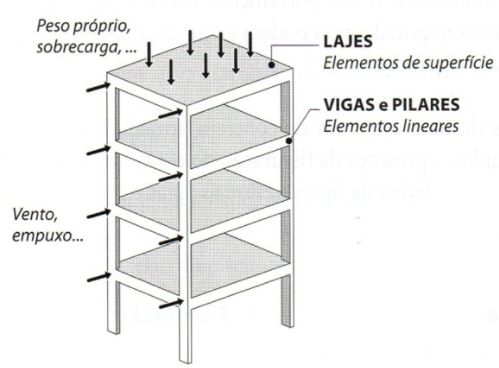

# Guia de Markdown

Esta página reúne instruções básicas para preencher arquivos Markdown (`.md`)
usados nas memórias de cálculo e demais entregas da disciplina, com exemplos
de sintaxe para headers, figuras, equações, tabelas e citações.

## Headers (títulos)

Os títulos são criados com o símbolo `#`. Quanto mais `#`, menor o nível do
título.

````
# Título principal (nível 1)
## Título de seção (nível 2)
### Título de subseção (nível 3)
````

**Assim fica:**

> # Título principal (nível 1)
> ## Título de seção (nível 2)
> ### Título de subseção (nível 3)

## Ênfase e listas

````
**texto em negrito**
*texto em itálico*

- item 1;
- item 2;
- item 3.

1. primeiro passo;
2. segundo passo;
3. terceiro passo.
````

**Assim fica:**

> **texto em negrito**
> *texto em itálico*
>
> - item 1;
> - item 2;
> - item 3.
>
> 1. primeiro passo;
> 2. segundo passo;
> 3. terceiro passo.

## Equações

Equações em LaTeX podem ser escritas *inline*, dentro do texto, usando `$`,
ou em bloco, destacadas do texto, usando `$$`.

````
Equação inline: $f_{ck}$

Equação em bloco:

$$
f_{ck,j} = \beta_{1(t,s)} \cdot f_{ck,28}
$$
````

**Assim fica:**

> Equação inline: $f_{ck}$
>
> Equação em bloco:
>
> $$
> f_{ck,j} = \beta_{1(t,s)} \cdot f_{ck,28}
> $$

## Figuras

Para inserir uma figura, use a sintaxe tradicional de imagem do Markdown,
``. Para poder referenciá-la depois
no texto, adicione uma âncora HTML (`<a id="fig-1"></a>`) antes da legenda —
o nome entre aspas (por exemplo, `fig-1`) é o rótulo usado no link de
referência.

````


<a id="fig-1"></a>**Figura 1.** Legenda descritiva da figura.
````

Para referenciar a figura no texto, use:

````
Conforme mostrado na [Figura 1](#fig-1)...
````

**Assim fica:**

> 
>
> <a id="fig-1"></a>**Figura 1.** Caminho das cargas: as lajes recebem ações superficiais, transferem-nas às vigas e estas as conduzem aos pilares.
>
> Conforme mostrado na [Figura 1](#fig-1)...

## Tabelas

Tabelas são escritas com `|` separando as colunas e uma linha de traços
`---` logo abaixo do cabeçalho. O símbolo `:` ao lado dos traços alinha a
coluna (`---:` alinha à direita).

````
| Critério | O que será avaliado | Pontuação |
|---|---|---:|
| Item 1 | Descrição do item 1 | 1,0 |
| Item 2 | Descrição do item 2 | 2,0 |
| **Total** | | **3,0** |
````

**Assim fica:**

> | Critério | O que será avaliado | Pontuação |
> |---|---|---:|
> | Item 1 | Descrição do item 1 | 1,0 |
> | Item 2 | Descrição do item 2 | 2,0 |
> | **Total** | | **3,0** |

## Citações e referências bibliográficas

As referências seguem o mesmo esquema de âncora e link usado nas figuras. No
texto, a citação é um link para a âncora definida na seção de Referências.

````
Conforme a [ABNT NBR 6118 [1]](#ref-1)...

## Referências

<a id="ref-1"></a>**[1]** ASSOCIAÇÃO BRASILEIRA DE NORMAS TÉCNICAS. **ABNT NBR 6118**: Projeto
de estruturas de concreto. 4. ed. Rio de Janeiro: ABNT, 2023.
````

**Assim fica:**

> Conforme a [ABNT NBR 6118 [1]](#ref-1)...
>
> ### Referências
>
> <a id="ref-1"></a>**[1]** ASSOCIAÇÃO BRASILEIRA DE NORMAS TÉCNICAS. **ABNT NBR 6118**: Projeto de estruturas de concreto. 4. ed. Rio de Janeiro: ABNT, 2023.

## Destaques

Para chamar atenção para um trecho do texto (avisos, dicas, entregas etc.),
use uma citação em bloco (`>`), com o título do destaque em negrito na
primeira linha.

````
> **Título do destaque**
>
> Texto do destaque.
````

**Assim fica:**

> **Título do destaque**
>
> Texto do destaque.

